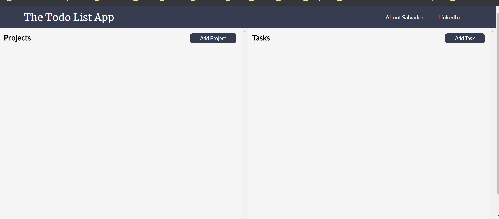

# Todo List
[The Odin Project: Javascript] - Project: Todo List

# Summary
Created a To-Do list application. You can create projects. Each project can have tasks. You can edit or delete tasks from a project as well.
This project also used to practice how to use npm and webpack

- Project Task: [The Odin Project - Todo List](https://www.theodinproject.com/courses/javascript/lessons/todo-list)
- View Project: https://salvillalon45.github.io/theOdinProject-TodoList/ 

### Implementation 
- Used DOM manipulation to render all the content of the website dynamically
- Developed with JavaScript, NPM, and Webpack to complete the application. Also, the JavaScript factory functions to organize code
- Built with LocalStorage to maintain data of the projects and tasks upon page refresh

### Demo

### 📗 Fonts used

-   [Lato](https://fonts.google.com/specimen/Lato?query=lato)
-   [Merriweather](https://fonts.google.com/specimen/Merriweather?query=Merriweather)

# Technologies:
  - HTML
  - CSS
  - JavaScript
  - npm
  - webpack
